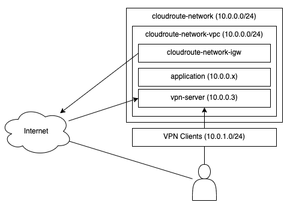

# Cloud Route

This is an Ubuntu OpenVPN based VPN router intended for use with AWS.  This document will explain:

1. AWS Network
2. Configuration
3. Deployment
4. Development

## 1. AWS Network

This will use Terraform to setup a VPC that OpenVPN clients can remote into.  The idea is to setup a private cloud where resources are not public on the internet.  This is a common practice in corporate networks.



## 2. Configuration

The following files are used to configure the system:

- terraform/terraform/values.[dev|qa|prod|dr].tfvars  
  Values used to deploy the AWS infrastructure

- ~/.aws-env.sh  
  AWS secrets that cannot get commited to GIT

- terraform/env.sh  
  Update update with S3 and region

- backend/src/Config.ts
  Server side configurations

- database/src/Config.ts
  Database deployment configurations

- vm-setup/install.sh
  Under "Installing cloud-route", around line 88, change the GIT repo if you need to start customizing

- terraform/terraform/vm.tf  
  Around line 17, modify the ingress for 4433 to allow anywhere access

## 3. Deployment

The deployment is dependent on AWS and Ubuntu Linux.  The following assumptions are made of the OS setup:

1. Login as ubuntu
2. ubuntu can sudo without needing a password
3. can connect to VM with SSH using a PEM certificate

The process will start with using Terraform to standup the environment.  The following commands will assume your starting in the same folder as the "cloud-route.code-workspace".

```
cd terraform
./init.sh dev
./plan.sh dev
./apply.sh dev
```

This will create the AWS resources and then execute:

- terraform/terraform/vm.after.sh  
  This is ran on you machine
- deploy-to-vm.sh  
  This is ran on your machine
- vm-setup/install.sh
  This is ran on the VM

Once this is completed, you VM should be running on a public IP address - this is documented in 'terraform/logins/vpn-server.[dev|qa|prod|dr].md'.

Next, log into the website and change the "administrator@localhost" password.

1. Login
2. Select "Session" on the top menu
3. On the left menu, choose "Account"
4. Enter you current and new password. Confirm your new password.  Click "Change".
5. Click "Session" on the top menu, then choose "Logout" on the left menu.
6. Log back in with your new password.

Next is to configure the certificates, client, and server.

1. Login
2. Choose "Router" from the top menu, then "OpenVPN" on the left menu.
3. Update the settings here and then click "Save".
4. Choose "Router" form the top menu, then "Certificates" on the left menu.
5. Click "Create CA".  Be patient, this will take a while (2-5 mins) as it generates the random keys.
6. Under "New Client", enter the first client's hostname and then click "Create Client".

This will generate the certificates required for the system to work. Next we'll need to apply the configuration and start/restart OpenVPN.

1. Choose "Router" from the top menu, the "OpenVPN" on the left menu.
2. Click the "Apply" button.

## 4. Development

Once you have a VM up and running, you should be able to connect to it.  The following script will create the SSH session:

- terraform/logins/vpn-server.[dev|qa|prod|dr].sh

You can also install the "Remote SSH" extension in VS Code:

- <https://marketplace.visualstudio.com/items?itemName=ms-vscode-remote.remote-ssh>

You'll need to run the following to "turn off" the web server:

```
sudo systemctl disable cloudroute
sudo systemctl stop cloudroute
```

You'll need to change the permissions of `/opt/couldroute`:

```
sudo chown -R ubuntu:ubuntu /opt/cloudroute
```
